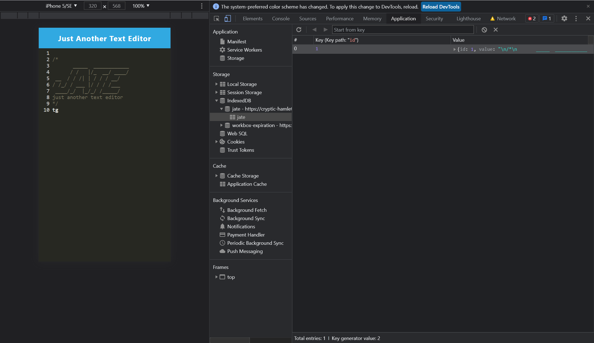

# 19 Progressive Web Applications (PWA): Text Editor

## Summary 

For this challenge, I built a text editor that runs in the browser. This app will be a single-page application that meets the PWA criteria. It will feature a number of data persistence techniques that serve as replacement in case one of the options are not supported by the browser. This application will also function offline, making it easier for clients to use when they are not online. 


## Table of Contents
- [Summary](#summary)
- [Description](#description)
- [User Story](#user-story)
- [Demo](#demo)
- [Screenshots](#screenshots)
- [Links](#links)
- [Questions](#questions)


## Description 

To build this text editor, you will start with an existing application and implement methods for getting and storing data to an IndexedDB database. You will use a package called `idb`, which is a lightweight wrapper around the IndexedDB API. It features a number of methods that are useful for storing and retrieving data, and is used by companies like Google and Mozilla.

## User Story

```md
AS A developer
I WANT to create notes or code snippets with or without an internet connection
SO THAT I can reliably retrieve them for later use
```

## Demo

The following animation demonstrates the application functionality:


The following image shows the application's `manifest.json` file:


The following image shows the application's registered service worker:


The following image shows the application's IndexedDB storage:



## Screenshots


## Links

Deployed URL: https://pure-badlands-50243.herokuapp.com
<br>
GitHub URL: https://github.com/RahmaBilal/pwa-22

## Questions
If you have any queries about this task or would like to contribute to it, then don't hesitate to contact me on: rahma.bilal@gmail.com. My GitHub is: https://github.com/RahmaBilal
